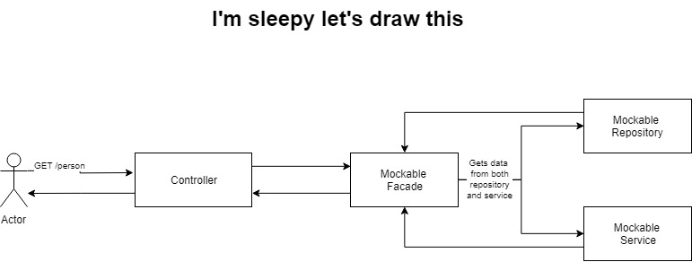

# Mocking/Sandboxing

# Maven wrapper and .mvn folder

Similar to `gradlew`, maven wrapper or `mvnw` is used to create maven configuration per project. `.mvn` folder stores the project-based configuration for maven. This creates a `npm`-esque experience when it comes to project based build setting.

Pros:

1. When running `.mvnw`, the project specific version of maven will be automatically downloaded and used.
1. Maven version can be specified per project
1. All additional arguments that need to be passed to maven can be specified in `./mvn/maven.config` file. (e.g., -DskipTest -Dmaven.wagon.http.ssl.insecure=true) can be specified locally so user can simply run `mvn clean install`
1. `settings.xml` specific to project can be added to `./mvn/local-settings.xml`
1. When onboarding new users, there is no need for them to figure out the settings to get started. All projects will have `.mvn` folder and they can figure out from there

Cons:

1. Using eclipse, the arguments passed to maven is still need to be set in the IDE. Eclipse doesn't detect .mvn folder and its configuration automatically

How to install:

1. run `mvn -N io.takari:maven:wrapper -Dmaven=3.5.2` on project root. maven version is optional
2. `.mvn` folder and `mvnw.cmd` will be created
3. Instead of `mvn clean install`, run `./mvnw clean install`. The former will run global maven, the latter will run local maven
